<!-- Everything below is animated SVG regenerated daily by
     .github/workflows/update-profile-art.yml — edit profile.json, not the SVGs. -->

<h3><code>lucas@github ~ $ ./contributions.sh</code></h3>

  

<h3><code>lucas@github ~ $ whoami</code></h3>

<table>
<tr>
<td valign="top"></td>
<td valign="top"></td>
</tr>
</table>

  

<h3><code>lucas@github ~ $ ./links.sh</code></h3>

<b>iOS & Android developer · UX designer · Brittany, FR</b>

